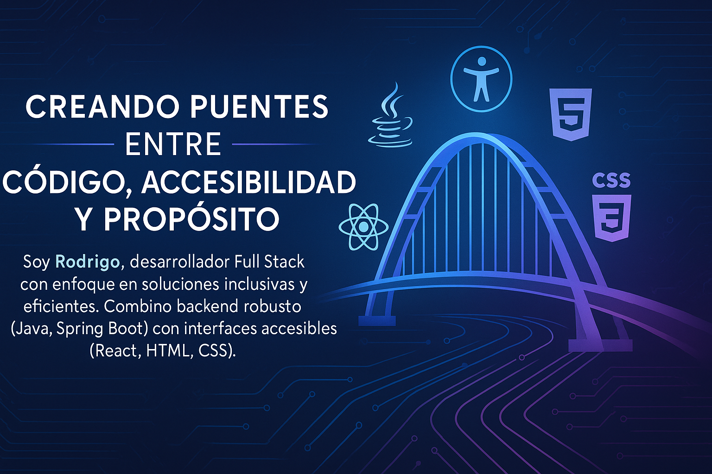

# 👋 ¡Hola! Soy Rodrigo Valderrama

Soy Desarrollador Full Stack Java, con experiencia en análisis de datos, diseño accesible y desarrollo inclusivo. Me apasiona crear soluciones tecnológicas que conecten código con propósito social. 💡

## 🚀 Proyectos destacados

- 🧠 [Nanai Kit – Plataforma emocional accesible](https://github.com/rodri-fullstack/nanai-kit)
- 🧩 [Mini Pokédex con filtros y favoritos](https://github.com/rodri-fullstack/pokedex-js)
- 👥 [CRUD Usuarios con JSON Server](https://github.com/rodri-fullstack/CRUDusuarios)

## 🌱 Actualmente
- 📚 Finalizando bootcamp Generation Chile (Full Stack Java)
- 🧑‍🏫 Promotor e instructor comunitario de Lengua de Señas Chilena
- ⚙️ Explorando accesibilidad web (WCAG, A11Y)

## 📫 Conectemos
- 💼 [LinkedIn](https://linkedin.com/in/rodri-fullstack)
- 🌐 [Portafolio Web (en construcción)](https://rodri-fullstacks-projects.vercel.app)
